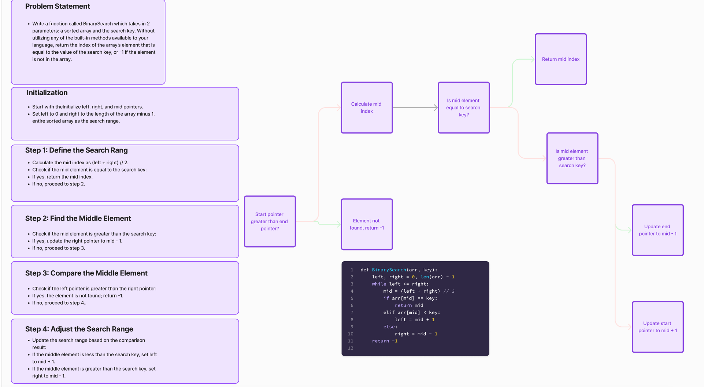

# Challenge Title
## Binary Search

## Whiteboard Process

## Approach & Efficiency
The code follows a binary search algorithm approach. It starts with a sorted array and repeatedly divides the search range in half by comparing the middle element with the search key. This approach is chosen because binary search is an efficient way to find an element in a sorted array.

## Solution
def BinarySearch(arr, key):
    left, right = 0, len(arr) - 1
    while left <= right:
        mid = (left + right) // 2
        if arr[mid] == key:
            return mid
        elif arr[mid] < key:
            left = mid + 1
        else:
            right = mid - 1
    return -1

Example usage:
arr = [1, 2, 3, 4, 5, 6, 7, 8, 9]
key = 5
result = BinarySearch(arr, key)
print("Element found at index:", result)
