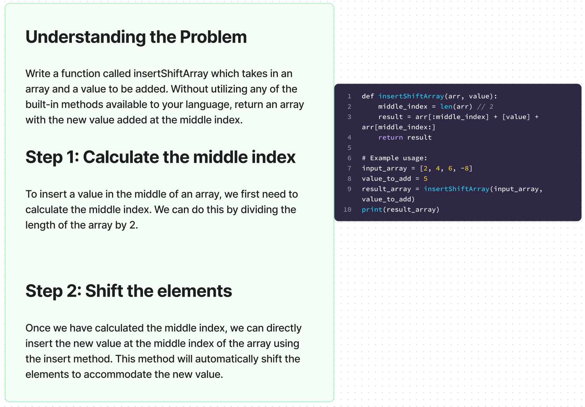

# Challenge Title

## Array Insert Shift

Description of the Challenge

Write a function called insertShiftArray which takes in an array and a value to be added. Without utilizing any of the built-in methods available to Python, return an array with the new value added at the middle index.

## Whiteboard Process

## Approach & Efficiency

I took the following approach to solve this challenge:

Calculate the middle index of the input array.
Use array slicing to split the input array into two parts: the first half and the second half.
Insert the new value at the middle index by creating a new array consisting of the first half, the new value, and the second half.
Return the resulting array.
The time complexity of this approach is O(n) because we need to create a new array and copy the elements from the original array. The space complexity is also O(n) because we are creating a new array to store the result.

## Solution

def insertShiftArray(arr, value):
    middle_index = len(arr) // 2
    result = arr[:middle_index] + [value] + arr[middle_index:]
    return result

Example usage:
input_array = [2, 4, 6, -8]
value_to_add = 5
result_array = insertShiftArray(input_array, value_to_add)
print(result_array)  # Output: [2, 4, 5, 6, -8]
