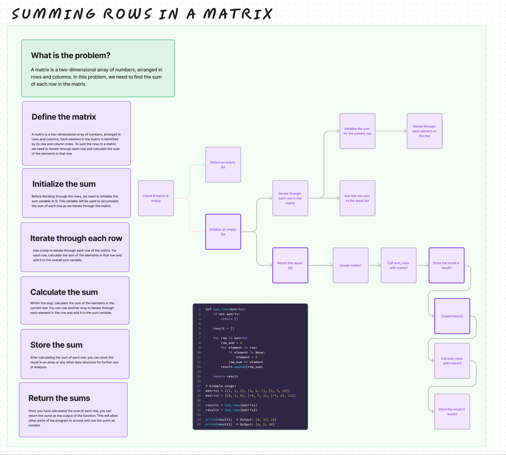

# Challenge Title

## Sum of Rows in a Matrix

## Whiteboard Process

## Approach & Efficiency

The approach taken in the code is to create a function sum_rows that calculates the sum of each row in a matrix of arbitrary size without using built-in methods like sum(). The function iterates through each row and element in the matrix, treating None values as zeros and summing up the elements for each row. The results are stored in a list, and the list of row sums is returned.

Time Complexity:
The code iterates through each row and element in the matrix, making it O(n * m), where n is the number of rows and m is the number of columns in the matrix.
Space Complexity:
The space complexity is O(n), where n is the number of rows, as the function creates a list to store the row sums.

## Solution

def sum_rows(matrix):
    # Check if the matrix is empty
    if not matrix:
        return []

    # Initialize an empty list to store the result
    result = []

    # Iterate through each row in the matrix
    for row in matrix:
        row_sum = 0  # Initialize the sum for the current row
        # Iterate through each element in the row
        for element in row:
            # If the element is None, treat it as 0
            if element is None:
                element = 0
            row_sum += element  # Add the element to the row sum
        result.append(row_sum)  # Add the row sum to the result list

    return result

## Example usage:

matrix1 = [[1, 2, 3], [3, 5, 7], [1, 7, 10]]
matrix2 = [[0, 1, 5], [-4, 7, 2], [-3, 12, 11]]

result1 = sum_rows(matrix1)
result2 = sum_rows(matrix2)

print(result1)  # Output: [6, 15, 18]
print(result2)  # Output: [6, 5, 20]

