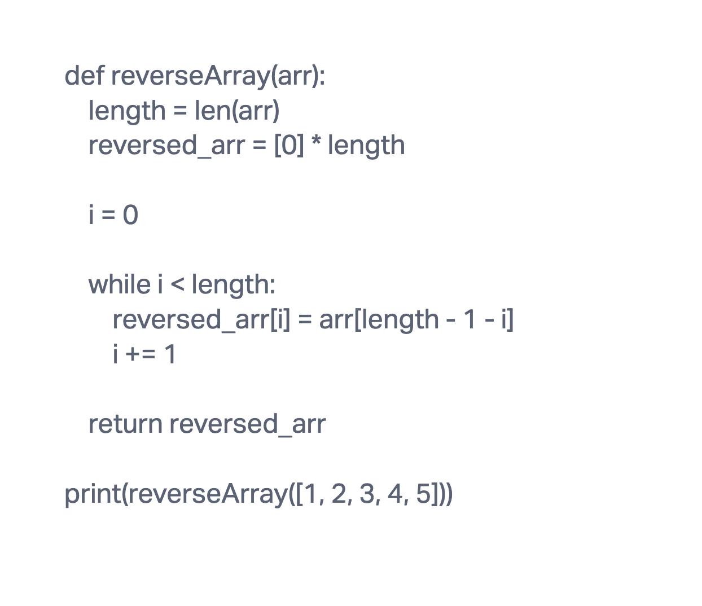

# Challenge Title
### Reversing an Array

## Whiteboard Process

## Approach & Efficiency
The approach is to iterate through the original array in reverse order and create a new array (reversed_arr) with the reversed elements.

Calculate the length of the original array (length).
Initialize an array (reversed_arr) with the same length as the original array.
Iterate through the original array in reverse, assigning elements to the new array.
Return the reversed array.

## Solution

def reverseArray(arr):
    length = len(arr)
    reversed_arr = [0] * length

    i = 0

    while i < length:
        reversed_arr[i] = arr[length - 1 - i]
        i += 1

    return reversed_arr

input_array = [1, 2, 3, 4, 5]
result = reverseArray(input_array)
print(f"Original Array: {input_array}")
print(f"Reversed Array: {result}")

output:
Original Array: [1, 2, 3, 4, 5]
Reversed Array: [5, 4, 3, 2, 1]
