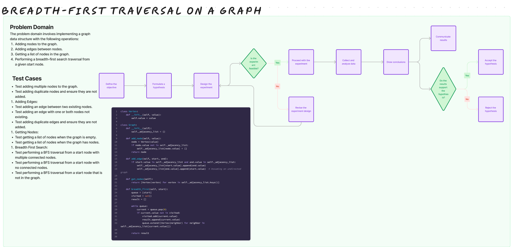

# Challenge Title

## Breadth-first traversal on a graph

## Whiteboard Process

## Approach & Efficiency

I implemented a graph data structure using an adjacency list representation. Nodes are represented by Vertex objects, and the graph is represented by a Graph class.

Adding Nodes/Edges: Adding nodes or edges is O(1) as it involves simple dictionary operations.
Getting Nodes: Getting nodes is O(V) as it requires iterating over the keys of the adjacency list.
BFS Traversal: BFS traversal is O(V + E) as it visits each vertex and edge once.
Space complexity is O(V + E) to store the vertices and edges in the adjacency list, where V is the number of vertices and E is the number of edges.

## Solution

[code](/python/data_structures/graph.py)
