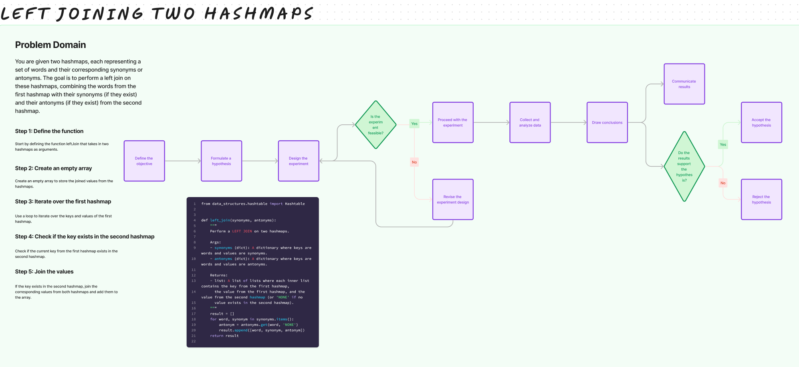

# Challenge Title

## left join operation on two hashmaps

## Whiteboard Process

## Approach & Efficiency

The time complexity of this approach is O(n), where n is the number of keys in the first hashmap. This is because we iterate through each key in the first hashmap and perform a constant time lookup in the second hashmap. The space complexity is also O(n), as we store the result in a list that grows with the number of keys in the first hashmap.

## Solution

[code](/python/code_challenges/hashtable_left_join.py)
