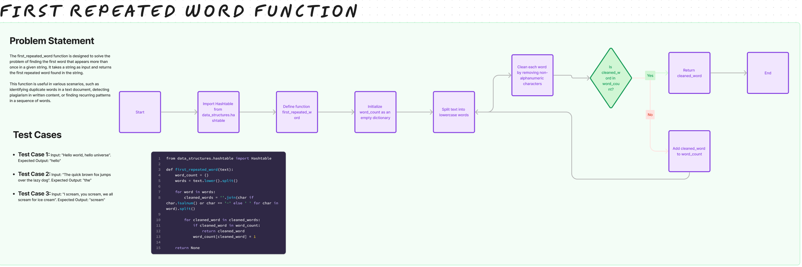

# Challenge Title

## Hashtable Repeated Word

## Whiteboard Process

## Approach & Efficiency

Approach:
The code iterates through each word in the input text, cleans it by removing punctuation and splitting hyphenated words, and then uses a dictionary to track the occurrence of each word. If a word is encountered more than once, it is returned as the first repeated word.

Why:
This approach efficiently identifies the first repeated word in the text by using a dictionary for fast lookups and handling word variations due to punctuation and hyphenation.

Big O Analysis:
Time Complexity: O(n * m) - where n is the number of words and m is the average length of the words.
Space Complexity: O(n) - due to the dictionary used to track word occurrences.

## Solution

[Code](/python/code_challenges/hashtable_repeated_word.py)
