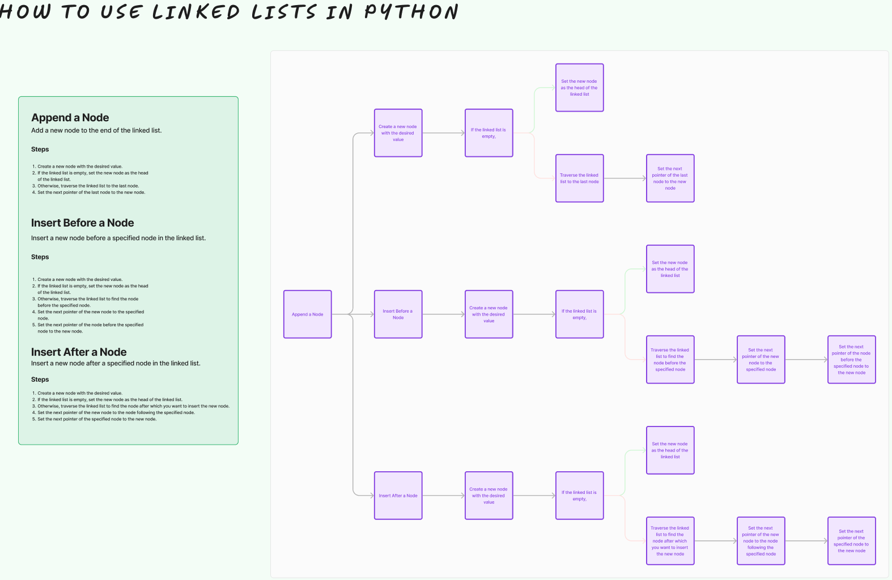

# Challenge Title

# Linked List Insertions

## Whiteboard Process

## Approach & Efficiency

* Append Method:
Approach: In the append method, we traverse the linked list to find the last node and then add the new node to the end.

Time Complexity: O(n) in the worst case, where n is the number of nodes in the list. This is because we have to traverse the entire list to find the last node.
Space Complexity: O(1) because we are not using any additional data structures.

* Insert Before Method:

Approach: In the insert_before method, we traverse the linked list to find the node with the specified value, and then insert the new node before it.

Time Complexity: O(n) in the worst case, where n is the number of nodes in the list. This is because we may need to traverse the entire list to find the node with the specified value.
Space Complexity: O(1) because we are not using any additional data structures.

* Insert After Method:

Approach: In the insert_after method, we traverse the linked list to find the node with the specified value, and then insert the new node after it.

Time Complexity: O(n) in the worst case, where n is the number of nodes in the list. This is because we may need to traverse the entire list to find the node with the specified value.
Space Complexity: O(1) because we are not using any additional data structures.

* Delete Method:

Approach: In the delete method, we traverse the linked list to find the node with the specified value and then remove it by updating the pointers.

Time Complexity: O(n) in the worst case, where n is the number of nodes in the list. This is because we may need to traverse the entire list to find the node with the specified value.
Space Complexity: O(1) because we are not using any additional data structures.

## Solution
[link to code](python/data_structures/linked_list.py)

Create a Linked List
linked_list = LinkedList()

Test append
linked_list.append(1)
linked_list.append(3)
linked_list.append(2)
linked_list.append(5)

Test insert_before
linked_list.insert_before(3, 4)

Test insert_after
linked_list.insert_after(3, 6)

Test delete
linked_list.delete(6)

