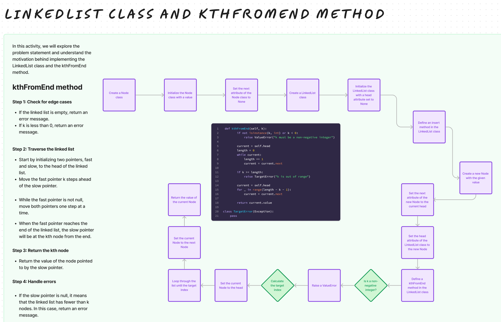

# Challenge Title

## Extending an Implementation

## Whiteboard Process

## Approach & Efficiency

The approach taken for the kthFromEnd method in the LinkedList class involves two main steps:

* Determine the Length of the LinkedList: The first traversal through the list computes its total length. This is necessary to determine the position of the node that is k places from the end, as we need to calculate its position from the start of the list.

* Find the Target Node: Using the length calculated, we determine the position of the target node from the start (which is length - k - 1). We then traverse the list again until we reach this node.
This approach ensures that we accurately find the node k places from the end, taking into account edge cases like when k is larger than the length of the list or when k is a negative value.

## Efficiency

Time Complexity: The time complexity of this method is O(n), where n is the number of nodes in the linked list. This is because, in the worst case, we need to traverse the entire list to calculate its length and then potentially traverse it again to find the kth node from the end.
Space Complexity: The space complexity is O(1). We only use a few variables to keep track of the current node and the length of the list, irrespective of the size of the linked list.

## Solution

[Link to code](/python/data_structures/linked_list.py)

