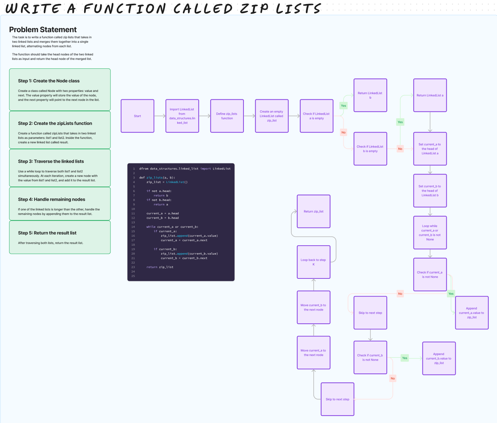

# Challenge Title

## Whiteboard Process

## Approach & Efficiency

The approach is to merge two linked lists list1 and list2 into a new linked list zip_list by alternating their elements. The algorithm iterates through both lists once, and the time complexity depends on the length of the longer list

## Solution

rom data_structures.linked_list import LinkedList

def zip_lists(a, b):
    zip_list = LinkedList()

    if not a.head:
        return b
    if not b.head:
        return a

    current_a = a.head
    current_b = b.head

    while current_a or current_b:
        if current_a:
            zip_list.append(current_a.value)
            current_a = current_a.next

        if current_b:
            zip_list.append(current_b.value)
            current_b = current_b.next

    return zip_list

