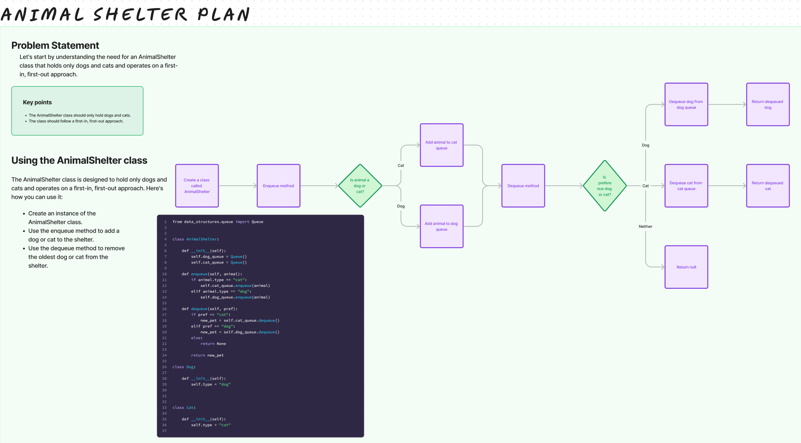

# Challenge Title

## Stack and Queue Animal Shelter

## Whiteboard Process

## Approach & Efficiency

The code uses two queues (one for dogs and one for cats) to manage an animal shelter.
When animals are enqueued, they are placed in the respective queues based on their type.
When dequeuing, animals are retrieved according to preference ("cat" or "dog").
Efficiency:
Enqueue: O(1) time and space complexity.
Dequeue: O(1) time and space complexity.
The code is efficient, with both enqueue and dequeue operations taking constant time and space.

## Solution

[stack_queue_animal_shelter](/python/code_challenges/stack_queue_animal_shelter.py)
