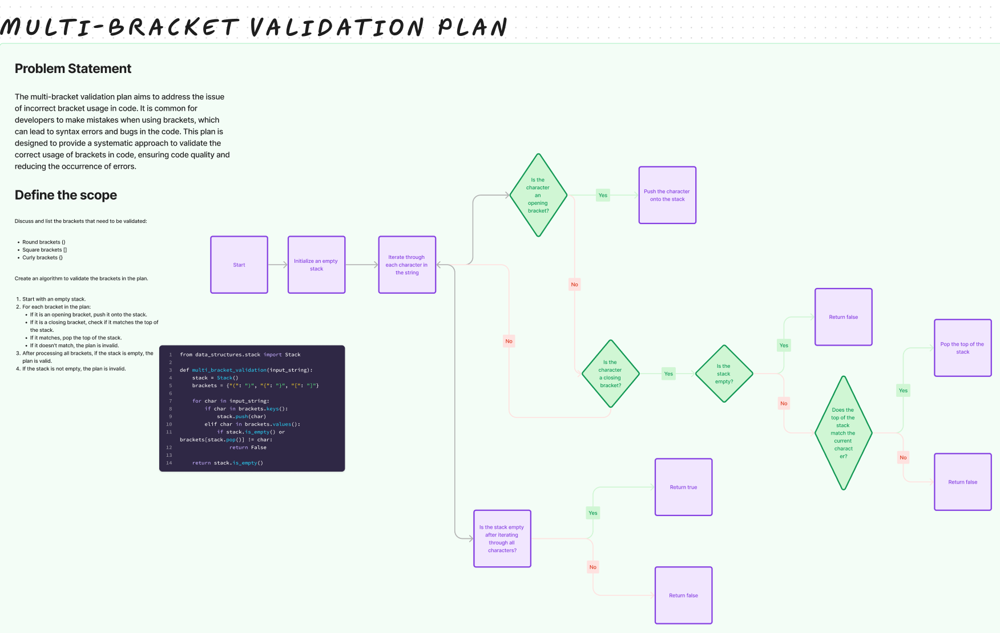

# Challenge Title

## brackets

## Whiteboard Process

## Approach & Efficiency

The approach is to use a stack to track opening brackets and check if each closing bracket matches the last opened bracket.

## Solution

[stack_queue_brackets](/python/code_challenges/stack_queue_brackets.py)
