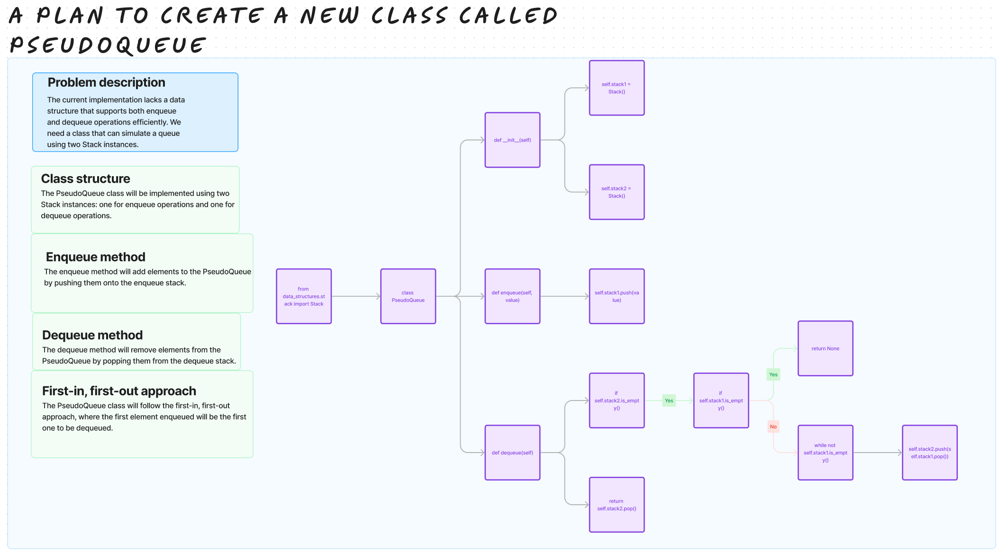

# Challenge Title

## Stack and Queue

## Whiteboard Process

## Approach & Efficiency

The approach for the PseudoQueue class uses two stacks to simulate a queue. Enqueueing takes O(1) time and space, while dequeuing takes O(n) time (amortized) and O(n) space in the worst case due to transferring elements between the stacks. Overall, it offers a reasonable balance of time and space efficiency for queue operations.

## Solution

[stack_queue_pseudo](/python/code_challenges/stack_queue_pseudo.py)
