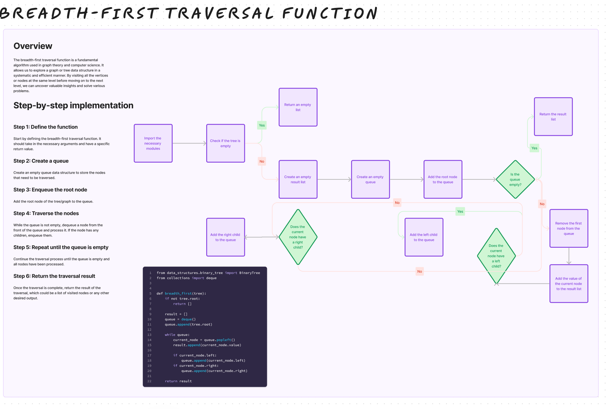

# Challenge Title

## Breadth First

## Whiteboard Process

## Approach & Efficiency

Approach: The code uses a breadth-first traversal approach, starting from the root and processing nodes level by level using a queue.

Time Complexity: O(N) - It visits each node once.

Space Complexity: O(N) - The space for the queue and the result list can potentially store all N nodes in the worst case.

## Solution

[tree_breadth_first](/python/code_challenges/tree_breadth_first.py)
