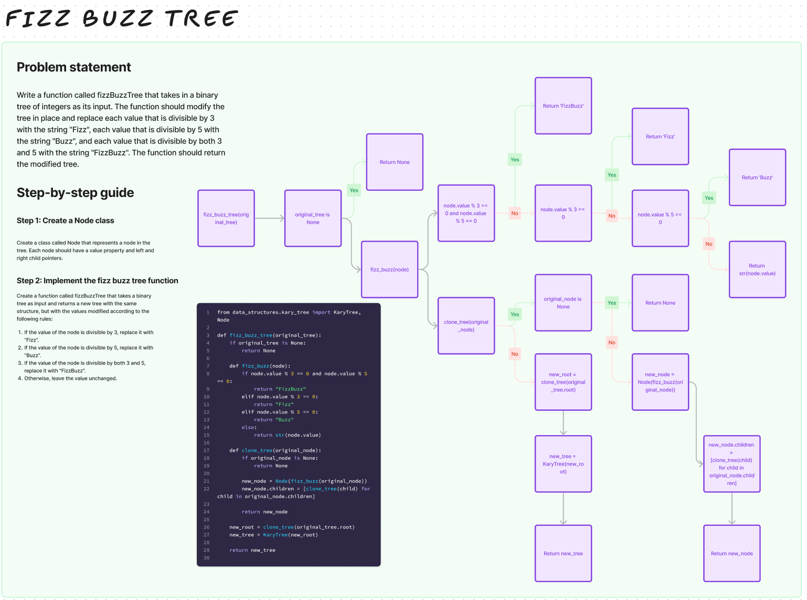

# Challenge Title

## Tree-fizz-buzz

## Whiteboard Process

## Approach & Efficiency

Approach:
I recursively traverse the original k-ary tree, applying FizzBuzz rules to create a new tree with modified values.

Big O Time Complexity:
O(N), where N is the number of nodes in the original tree.

Big O Space Complexity:
O(N) due to the recursive calls and space needed for the new tree.

## Solution

[tree_fizz_buzz](/python/code_challenges/tree_fizz_buzz.py)
