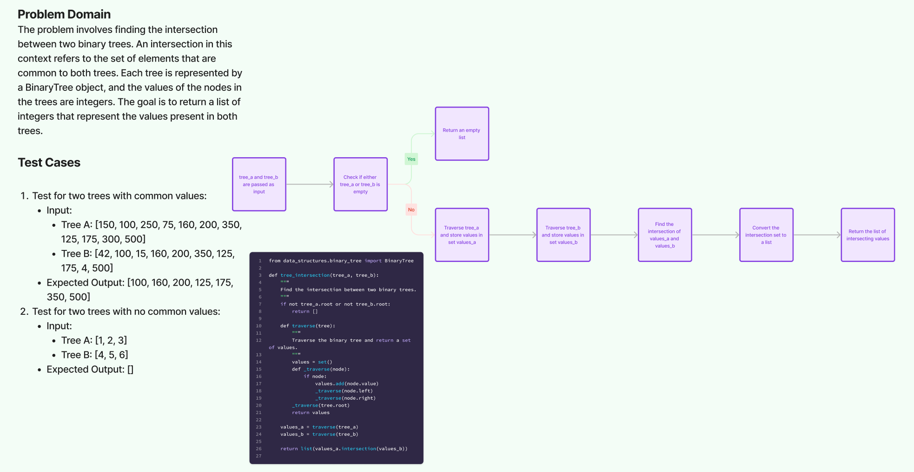

# Challenge Title

## Tree intersection

## Whiteboard Process

## Approach & Efficiency

The approach involves traversing each tree to collect values in sets and then finding the intersection of these sets. This method is efficient because sets in Python offer fast lookup and insertion.

Time Complexity: O(n + m), where n and m are the number of nodes in the first and second trees, respectively.
Space Complexity: O(n + m), for storing the values of the nodes in sets.

## Solution

[Code](/python/code_challenges/tree_intersection.py)
