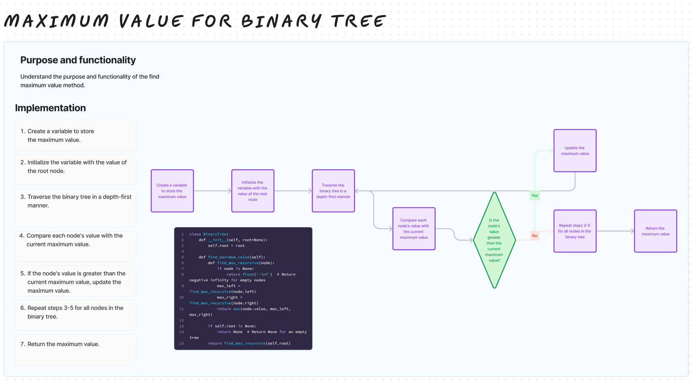

# Challenge Title

## Maximum Value in a Binary Tree

## Whiteboard Process

## Approach & Efficiency

For finding the maximum value in the tree, a recursive approach is used, visiting each node once

## Solution

[binary_tree.py](/python/data_structures/binary_tree.py)
